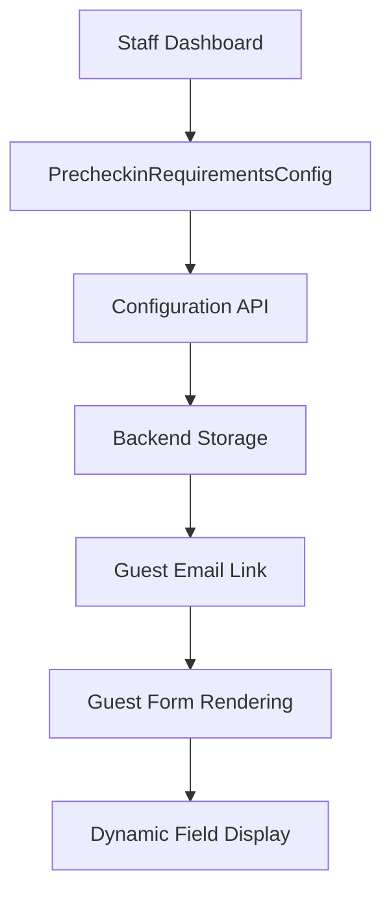
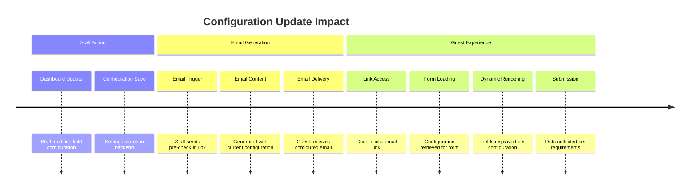

# How the Booking Management Dashboard Influences Pre-Check-in Email Configuration

**Created:** December 23, 2025  
**Status:** Documentation  

## Overview

The Booking Management Dashboard serves as the central control point that directly influences how pre-check-in emails are configured and what information guests are prompted to provide. This document explains the comprehensive relationship between dashboard settings, email content, and guest form presentation.

## 1. Dashboard Configuration Control Flow

### 1.1 Pre-Check-in Requirements Configuration Component

**Location:** [PrecheckinRequirementsConfig.jsx](hotelmate-frontend/src/components/bookings/PrecheckinRequirementsConfig.jsx)

The dashboard contains a dedicated configuration panel that allows hotel staff to control:
- **Field Visibility**: Which fields appear in guest pre-check-in forms
- **Field Requirements**: Which fields are mandatory vs. optional
- **Email Triggering**: When pre-check-in emails are sent

```jsx
// Configuration state structure
const [config, setConfig] = useState({ 
  enabled: {},   // Controls field visibility
  required: {}   // Controls field requirements
});
```

### 1.2 API Integration Pattern

**Configuration Endpoint:** `/staff/hotel/{hotelSlug}/precheckin-config/`
- **GET**: Retrieves current configuration
- **POST**: Updates configuration settings

**Guest Form Endpoint:** `/hotel/{hotelSlug}/precheckin/?token={token}`
- Receives configuration data that shapes the guest experience

## 2. Email Configuration Influence Chain

### 2.1 Staff Dashboard → Configuration Storage → Email Content



### 2.2 Configuration Data Structure

The dashboard controls email behavior through two key objects:

```json
{
  "precheckin_config": {
    "enabled": {
      "eta": true,
      "nationality": true,
      "special_requests": false,
      "consent_checkbox": true
    },
    "required": {
      "eta": false,
      "nationality": true,
      "special_requests": false,
      "consent_checkbox": true
    }
  }
}
```

## 3. Dashboard Components That Influence Email Configuration

### 3.1 Booking Management Dashboard

**File:** [BookingManagementDashboard.jsx](hotelmate-frontend/src/components/bookings/BookingManagementDashboard.jsx)

This main dashboard component:
- Renders the configuration interface
- Provides hotel-specific settings context
- Ensures proper user authentication before configuration access

```jsx
const BookingManagementDashboard = ({ hotelSlug }) => {
  // Configuration interface rendered within dashboard
  return (
    <Container fluid className="py-4">
      <Row className="mb-4">
        <Col>
          <h2>Booking Management Dashboard</h2>
          <p className="text-muted">Manage your hotel's booking settings and requirements.</p>
        </Col>
      </Row>
      
      <Row className='justify-content-center p-1'>
        <Col lg={8}>
          <PrecheckinRequirementsConfig hotelSlug={currentHotelSlug} />
        </Col>
      </Row>
    </Container>
  );
};
```

### 3.2 Field Configuration Interface

The dashboard provides a toggle-based interface for each available field:

| Dashboard Control | Email Impact | Guest Form Result |
|------------------|--------------|-------------------|
| **Enabled: OFF** | Field not mentioned in email | Field hidden from guest |
| **Enabled: ON, Required: OFF** | Field listed as "optional" in email | Field shown as optional |
| **Enabled: ON, Required: ON** | Field listed as "required" in email | Field shown as mandatory |

### 3.3 Configuration Validation Rules

The dashboard enforces critical business rules:

```jsx
// Hard Rule: Required fields must be enabled first
const handleRequiredChange = (fieldKey, isRequired) => {
  // Only allow if enabled
  if (!config.enabled[fieldKey] && isRequired) return;
  
  setConfig(prev => ({
    ...prev,
    required: { ...prev.required, [fieldKey]: isRequired }
  }));
};

// Hard Rule: Disabling a field clears its required status
const handleEnabledChange = (fieldKey, isEnabled) => {
  setConfig(prev => {
    const newConfig = {
      ...prev,
      enabled: { ...prev.enabled, [fieldKey]: isEnabled }
    };
    
    // If disabling, also clear required
    if (!isEnabled) {
      newConfig.required = { ...prev.required, [fieldKey]: false };
    }
    
    return newConfig;
  });
};
```

## 4. Email Sending Configuration Influence

### 4.1 Email Trigger Conditions

The dashboard configuration influences when emails can be sent:

**Booking Actions Component:** [BookingActions.jsx](hotelmate-frontend/src/components/staff/bookings/BookingActions.jsx)

```jsx
// Email sending conditions influenced by dashboard state
const canSendPrecheckin = booking.status === 'CONFIRMED' && 
  (booking.guest_email || booking.primary_email || booking.booker_email);

// Email content includes configuration-specific information
const emailMessage = `Send pre-check-in link for booking ${booking.booking_id}?

Email will be sent to: ${booking.guest_email || booking.primary_email || booking.booker_email}`;
```

### 4.2 Email Content Personalization

The configuration set in the dashboard determines:
- **Subject Line**: Reflects required vs. optional information requests
- **Body Content**: Lists specific fields the guest needs to complete
- **Call-to-Action**: Emphasizes required fields for completion

## 5. Guest Experience Configuration Chain

### 5.1 Configuration Propagation to Guest Forms

When guests receive the email and click the link, the dashboard configuration directly controls their experience:

**Guest Data Loading:** [usePrecheckinData.js](hotelmate-frontend/src/hooks/usePrecheckinData.js)

```js
// Configuration loaded when guest accesses pre-check-in link
const response = await publicAPI.get(
  `/hotel/${hotelSlug}/precheckin/?token=${encodeURIComponent(token)}`
);

// Dashboard configuration shapes form rendering
setConfig({
  enabled: precheckin_config.enabled || {},
  required: precheckin_config.required || {}
});
```

### 5.2 Dynamic Form Rendering

**Form Hook:** [usePrecheckinForm.js](hotelmate-frontend/src/hooks/usePrecheckinForm.js)

```js
// Field rendering logic based on dashboard configuration
if (config.enabled[fieldKey] === true) {
  renderField(fieldKey, config.required[fieldKey])
}
```

## 6. Available Configuration Fields

### 6.1 Booking-Level Fields
These fields apply to the entire booking:

| Field | Purpose | Dashboard Control | Email Impact |
|-------|---------|-------------------|--------------|
| **eta** (Estimated Arrival) | Guest arrival time planning | Enable/Require toggle | Listed in email requirements |
| **special_requests** | Guest preferences/needs | Enable/Require toggle | Mentioned as optional/required |
| **consent_checkbox** | Legal agreement acceptance | Enable/Require toggle | Highlighted as mandatory |

### 6.2 Guest-Level Fields
These fields are collected for each guest:

| Field | Purpose | Dashboard Control | Email Impact |
|-------|---------|-------------------|--------------|
| **nationality** | Immigration/reporting requirements | Enable/Require toggle | Emphasized for compliance |
| **country_of_residence** | Tax/legal reporting | Enable/Require toggle | Listed for legal requirements |
| **date_of_birth** | Age verification | Enable/Require toggle | Mentioned for verification |
| **address_line_1** | Contact information | Enable/Require toggle | Listed for registration |

## 7. Configuration Update Workflow

### 7.1 Staff Dashboard Process

1. **Access Configuration**: Staff navigates to Booking Management Dashboard
2. **Modify Settings**: Toggle fields between Enabled/Disabled and Required/Optional
3. **Validation Check**: System enforces "Required ⊆ Enabled" rule
4. **Save Configuration**: Settings stored via API
5. **Immediate Effect**: New pre-check-in emails use updated configuration

### 7.2 Guest Impact Timeline



## 8. Configuration Best Practices

### 8.1 Field Selection Strategy

**Required Fields**: Choose based on:
- Legal/compliance requirements
- Operational necessity
- Guest friction tolerance

**Optional Fields**: Enable for:
- Enhanced service personalization
- Marketing data collection
- Guest preference accommodation

### 8.2 Email Communication Impact

**Clear Communication**: Configuration should ensure emails clearly indicate:
- Which information is mandatory
- Why specific information is needed
- Estimated time to complete

**Guest Expectations**: Dashboard settings should align with:
- Hotel branding and service level
- Local regulations and compliance needs
- Operational workflow requirements

## 9. Technical Integration Points

### 9.1 API Contracts

**Configuration API**:
```javascript
// GET /staff/hotel/{hotelSlug}/precheckin-config/
{
  "enabled": { "field_key": boolean },
  "required": { "field_key": boolean },
  "field_registry": { "field_key": { "label": string, "type": string } }
}
```

**Guest API**:
```javascript
// GET /hotel/{hotelSlug}/prechecin/?token={token}
{
  "precheckin_config": { "enabled": {}, "required": {} },
  "precheckin_field_registry": {},
  "booking": {},
  "party": {}
}
```

### 9.2 State Synchronization

The system ensures configuration changes immediately affect:
- New pre-check-in email content
- Guest form field visibility
- Validation requirements
- Completion status tracking

## 10. Summary

The Booking Management Dashboard serves as the single source of truth for pre-check-in email configuration. Through its intuitive interface, hotel staff control not only what information guests are asked to provide, but how that request is communicated via email. This creates a seamless flow from dashboard configuration to guest experience, ensuring consistency between staff expectations and guest interactions.

The configuration influence spans:
- **Email Trigger Conditions**: When emails can be sent
- **Email Content**: What fields are mentioned and emphasized
- **Form Rendering**: Which fields appear and their requirement level
- **Validation Logic**: What must be completed for submission
- **Staff Notifications**: What completion status is displayed

This architecture ensures that any changes made in the dashboard immediately improve the entire pre-check-in workflow without requiring technical intervention.