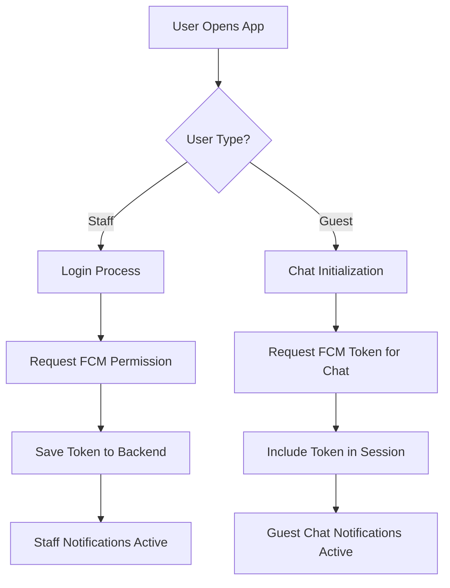

# 📱 HotelMate Notifications Usage - Complete Guide

This document provides a comprehensive overview of all Pusher and FCM notification implementations in the HotelMate frontend codebase.

---

## 📋 **Table of Contents**

1. [🔧 Configuration & Setup](#-configuration--setup)
2. [📡 Pusher Real-time Notifications](#-pusher-real-time-notifications)
3. [🔔 FCM Push Notifications](#-fcm-push-notifications)
4. [🎯 Custom Window Events](#-custom-window-events)
5. [📍 Implementation Files](#-implementation-files)
6. [🔄 Real-time Integration Points](#-real-time-integration-points)

---

## 🔧 **Configuration & Setup**

### Environment Variables Required
```env
# Pusher Configuration
VITE_PUSHER_KEY=your_pusher_key
VITE_PUSHER_CLUSTER=your_cluster

# Firebase FCM Configuration
VITE_FIREBASE_VAPID_KEY=your_vapid_key
VITE_FIREBASE_API_KEY=your_api_key
VITE_FIREBASE_PROJECT_ID=your_project_id
VITE_FIREBASE_MESSAGING_SENDER_ID=your_sender_id
VITE_FIREBASE_APP_ID=your_app_id
```

### Service Worker Files
- **Development:** `/firebase-messaging-sw.js`
- **Production:** `https://hotelsmates.com/firebase-messaging-sw.js`

---

## 📡 **Pusher Real-time Notifications**

### 🎯 **Core Pusher Hooks & Components**

#### 1. **Attendance Real-time Updates**
**File:** `src/features/attendance/hooks/useAttendanceRealtime.js`
```javascript
// Channel: hotel-{hotel_slug}
// Events: clock-status-updated, clock-status-changed, attendance_update
useAttendanceRealtime(hotelSlug, onEvent)
```

#### 2. **Department Attendance Status**
**File:** `src/features/attendance/hooks/useDepartmentAttendanceStatus.js`
```javascript
// Real-time department status updates for approvals and active staff
// Integrates with: DepartmentStatusSummary component
```

#### 3. **Staff Chat Real-time**
**File:** `src/staff_chat/context/StaffChatContext.jsx`
```javascript
// Channel: staff-chat-hotel-{hotel_slug}
// Events: new-message, message-edited, message-deleted, message-reaction
```

#### 4. **Hotel Galleries Real-time**
**File:** `src/hooks/useHotelGalleries.js`
```javascript
// Channel: gallery-hotel-{hotel_slug}
// Events: gallery-updated, image-added, image-removed
```

#### 5. **Room Service Notifications**
**File:** `src/context/RoomServiceNotificationContext.jsx`
```javascript
// Channel: room-service-hotel-{hotel_slug}
// Events: new-order, order-updated, order-completed
```

#### 6. **Guest Chat (Public)**
**File:** `src/hooks/useGuestPusher.js`
```javascript
// Channel: guest-chat-hotel-{hotel_slug}
// Events: new-message, staff-reply, guest-message
```

#### 7. **General Hotel Real-time**
**File:** `src/hooks/useHotelRealtime.js`
```javascript
// Channel: hotel-{hotel_slug}
// Events: offer-created, offer-updated, offer-deleted, offer-image-updated
```

### 📋 **Pusher Channel Patterns**

| **Feature** | **Channel Pattern** | **Events** |
|-------------|-------------------|------------|
| **Attendance** | `hotel-{hotel_slug}` | `clock-status-updated`, `attendance_update` |
| **Attendance Personal** | `attendance-hotel-{hotel_slug}-staff-{staff_id}` | `clocklog-approved`, `clocklog-rejected` |
| **Staff Chat** | `staff-chat-hotel-{hotel_slug}` | `new-message`, `message-edited`, `message-deleted` |
| **Room Service** | `room-service-hotel-{hotel_slug}` | `new-order`, `order-updated`, `order-completed` |
| **Hotel Galleries** | `gallery-hotel-{hotel_slug}` | `gallery-updated`, `image-added`, `image-removed` |
| **Guest Chat** | `guest-chat-hotel-{hotel_slug}` | `new-message`, `staff-reply`, `guest-message` |
| **Hotel Offers** | `hotel-{hotel_slug}` | `offer-created`, `offer-updated`, `offer-deleted` |

---

## 🔔 **FCM Push Notifications**

### 🎯 **FCM Implementation Files**

#### 1. **Core FCM Utilities**
**File:** `src/utils/fcm.js`
- Handles FCM token registration
- Service worker registration (dev/prod paths)
- Permission requests

#### 2. **Firebase Notifications**
**File:** `src/utils/firebaseNotifications.js`
- Staff FCM token management
- Foreground message listening
- Backend token synchronization

#### 3. **Guest Chat Session**
**File:** `src/utils/guestChatSession.js`
- Guest FCM token registration during chat initialization
- Token storage for guest notifications

### 📋 **FCM Usage Patterns**

| **User Type** | **Token Storage** | **API Endpoint** | **Usage** |
|---------------|------------------|------------------|-----------|
| **Staff** | `staff/save-fcm-token/` | Backend DB | Shift notifications, chat messages |
| **Guest** | Chat session initialization | Temporary | Chat replies, service updates |

### 🔄 **FCM Token Flow**



---

## 🎯 **Custom Window Events**

### 📡 **Cross-Component Communication Events**

#### 1. **Face Clock Actions**
```javascript
// Event: 'face-clock-action-success'
// Files: FaceClockInPage.jsx, useFaceApi.js
window.dispatchEvent(new CustomEvent('face-clock-action-success', {
  detail: { action, hotelSlug, data }
}));
```

#### 2. **Clock Status Changes**
```javascript
// Event: 'clockStatusChanged'
// File: ClockModal.jsx
window.dispatchEvent(new CustomEvent('clockStatusChanged', {
  detail: { action, staffData }
}));
```

#### 3. **Staff Status Updates**
```javascript
// Event: 'staffStatusUpdated'
// File: BigScreenNavbar.jsx
window.dispatchEvent(new CustomEvent('staffStatusUpdated', {
  detail: { status, timestamp }
}));
```

#### 4. **Pusher Clock Status**
```javascript
// Event: 'pusherClockStatusUpdate'
// Files: AttendanceDashboard.jsx, statusUpdates.js
window.dispatchEvent(new CustomEvent('pusherClockStatusUpdate', {
  detail: { type, payload }
}));
```

#### 5. **Theme Preset Changes**
```javascript
// Event: 'presetChange'
// File: MobileNavbar.jsx
window.dispatchEvent(new CustomEvent('presetChange', { 
  detail: { variant } 
}));
```

---

## 📍 **Implementation Files**

### 🔧 **Pusher Implementation Files**

| **File Path** | **Purpose** | **Channel(s)** |
|---------------|-------------|----------------|
| `src/features/attendance/hooks/useAttendanceRealtime.js` | Attendance real-time updates | `hotel-{hotel_slug}` |
| `src/features/attendance/hooks/useDepartmentAttendanceStatus.js` | Department status with Pusher | `attendance-hotel-{hotel_slug}-staff-{staff_id}` |
| `src/features/attendance/components/DepartmentStatusSummary.jsx` | Real-time approval notifications | Personal channel |
| `src/staff_chat/context/StaffChatContext.jsx` | Staff chat real-time | `staff-chat-hotel-{hotel_slug}` |
| `src/staff_chat/hooks/usePusher.js` | Generic Pusher hook | Various |
| `src/context/RoomServiceNotificationContext.jsx` | Room service updates | `room-service-hotel-{hotel_slug}` |
| `src/context/BookingNotificationContext.jsx` | Booking notifications | `booking-hotel-{hotel_slug}` |
| `src/context/ChatContext.jsx` | General chat context | Multiple channels |
| `src/hooks/useHotelGalleries.js` | Gallery real-time updates | `gallery-hotel-{hotel_slug}` |
| `src/hooks/useHotelRealtime.js` | Hotel-wide real-time | `hotel-{hotel_slug}` |
| `src/hooks/useGuestPusher.js` | Guest chat real-time | `guest-chat-hotel-{hotel_slug}` |

### 🔔 **FCM Implementation Files**

| **File Path** | **Purpose** | **Token Scope** |
|---------------|-------------|-----------------|
| `src/utils/fcm.js` | Core FCM functionality | All users |
| `src/utils/firebaseNotifications.js` | Staff notifications | Staff only |
| `src/utils/guestChatSession.js` | Guest chat notifications | Guest sessions |
| `src/staff_chat/hooks/useStaffChatNotifications.js` | Chat-specific FCM | Staff chat |
| `src/staff_chat/components/StaffChatNotificationProvider.jsx` | Chat notification provider | Staff chat |

### 🎯 **Notification Context Providers**

| **Provider** | **File** | **Scope** |
|--------------|----------|-----------|
| `RoomServiceNotificationContext` | `src/context/RoomServiceNotificationContext.jsx` | Room service orders |
| `BookingNotificationContext` | `src/context/BookingNotificationContext.jsx` | Booking updates |
| `StaffChatContext` | `src/staff_chat/context/StaffChatContext.jsx` | Staff messaging |
| `ChatContext` | `src/context/ChatContext.jsx` | General chat |

---

## 🔄 **Real-time Integration Points**

### 🎯 **Attendance System**

#### **Components Using Attendance Real-time:**
- `DepartmentRosterDashboard.jsx` - Real-time roster updates
- `AttendanceDashboard.jsx` - Live attendance monitoring  
- `DepartmentStatusSummary.jsx` - Approval notifications
- `BigScreenNavbar.jsx` - Staff status display
- `FaceClockInPage.jsx` - Face recognition updates

#### **Event Flow:**
```
Staff Action → Backend → Pusher Event → Frontend Hook → Component Update
```

### 🎯 **Chat System**

#### **Components Using Chat Real-time:**
- `StaffChatContext.jsx` - Message synchronization
- `ConversationList.jsx` - New message indicators
- `MessageList.jsx` - Live message updates
- `QuickNotificationButtons.jsx` - Notification shortcuts

#### **Event Flow:**
```
Message Sent → Backend → Pusher Event → Chat Context → UI Update + FCM Notification
```

### 🎯 **Hotel Management**

#### **Components Using Hotel Real-time:**
- Hotel galleries - Live image updates
- Offer management - Real-time offer changes
- Room service - Order status updates
- Booking system - Reservation updates

---

## 📊 **Notification Event Summary**

### **Total Pusher Channels:** 7 types
### **Total FCM Token Types:** 2 (Staff, Guest)
### **Total Custom Events:** 5 types
### **Total Real-time Components:** 15+

### **Key Integration Files:**
1. **Attendance:** `useAttendanceRealtime.js` (291 lines)
2. **Staff Chat:** `StaffChatContext.jsx` (Pusher + FCM)
3. **FCM Core:** `fcm.js` (64 lines)
4. **Firebase Notifications:** `firebaseNotifications.js` (64 lines)

---

## 🔍 **Usage Patterns**

### **Pusher Usage Pattern:**
```javascript
// 1. Initialize Pusher connection
const pusher = new Pusher(VITE_PUSHER_KEY, { cluster: VITE_PUSHER_CLUSTER });

// 2. Subscribe to channel
const channel = pusher.subscribe(`hotel-${hotelSlug}`);

// 3. Bind to events
channel.bind('event-name', (data) => {
  // Handle real-time data
});

// 4. Cleanup on unmount
channel.unbind_all();
channel.unsubscribe();
pusher.disconnect();
```

### **FCM Usage Pattern:**
```javascript
// 1. Request permission
const permission = await Notification.requestPermission();

// 2. Get FCM token
const token = await getToken(messaging, { vapidKey });

// 3. Save token to backend
await api.post('/save-fcm-token/', { fcm_token: token });

// 4. Listen for foreground messages
onMessage(messaging, (payload) => {
  // Handle incoming notification
});
```

---

## 🎯 **Key Takeaways**

1. **Pusher** handles real-time data synchronization across components
2. **FCM** manages push notifications for offline users
3. **Custom Events** enable cross-component communication without tight coupling
4. **Channel naming** follows consistent patterns: `{feature}-hotel-{hotel_slug}`
5. **Token management** differs between staff (persistent) and guests (session-based)
6. **Real-time updates** are crucial for attendance, chat, and hotel management features

This comprehensive guide covers all notification implementations in the HotelMate frontend, providing a complete reference for developers working with real-time features.