# 🚨 Room Data Inconsistency Analysis

## 📊 **Data Discrepancy Identified**

### 🏠 **Room 101 - Data Comparison**

| Component | Guest Status | Guest Info | Occupancy Status | Data Source |
|-----------|-------------|------------|------------------|-------------|
| **Room List (Card)** | Shows guest | "Nikola Simic +1 companion" | "Occupied" | `turnover/rooms/` API |
| **Room Details** | No guest | "No current guests. Ready for next booking." | "Ready For Guest" | `room-management/{roomNumber}/` API |

---

## 🔍 **Root Cause Analysis**

### 📡 **Different Data Sources**

**Room List (RoomCard.jsx):**
```javascript
// Data from: /api/staff/hotel/{hotel_slug}/turnover/rooms/
room.primary_guest = {
  first_name: "Nikola", 
  last_name: "Simic"
}
room.companions = [{ /* companion data */ }]
room.is_occupied = true
```

**Room Details (RoomDetails.jsx):**
```javascript  
// Data from: /api/staff/hotel/{hotel_slug}/room-management/{roomNumber}/
room.guests_in_room = [] // Empty or missing
room.room_status = "READY_FOR_GUEST"
room.is_occupied = false
```

### 🚫 **Data Sync Issues**

1. **Different Endpoints** - Two separate APIs returning conflicting room state
2. **Update Timing** - One endpoint updated, other still has stale data
3. **Database Inconsistency** - Guest checkout completed on one table, not synchronized to others

---

## 📋 **Field Mapping Analysis**

### **Guest Information Fields**

| Field | Room List Source | Room Details Source | Status |
|-------|-----------------|-------------------|---------|
| **Guest Name** | `room.primary_guest.first_name/last_name` | `room.guests_in_room[].first_name/last_name` | ❌ **Different Fields** |
| **Companions** | `room.companions[]` | Not shown | ❌ **Missing in Details** |
| **Occupancy** | `room.is_occupied` | `room.is_occupied && room.room_status === 'OCCUPIED'` | ❌ **Different Logic** |
| **Room Status** | `room.room_status_display` | `room.room_status` | ⚠️ **Format Difference** |

### **Status Display Logic**

**Room List:**
```jsx
// Shows status from room_status_display OR fallback
{room.room_status_display || room.room_status || (room.is_occupied ? 'Occupied' : 'Ready')}

// Occupancy badge
<span className={`badge ${room.is_occupied ? 'bg-danger' : 'bg-success'}`}>
  {room.is_occupied ? 'Occupied' : 'Ready'}
</span>
```

**Room Details:**
```jsx
// Shows guest info only if BOTH conditions true
{(currentRoom.is_occupied && currentRoom.room_status === 'OCCUPIED') ? (
  // Show guest details
) : (
  // Show "No current guests"
)}
```

---

## 🎯 **Data Flow Problems**

### **Scenario: Guest Checkout**

```mermaid
graph TD
    A[Guest Checks Out] --> B[Backend Updates]
    B --> C{Which Tables Updated?}
    C --> D[Housekeeping Status Table ✅]
    C --> E[Room Status Table ❓]
    C --> F[Guest Assignment Table ❓]
    D --> G[room-management/ API ✅]
    E --> H[turnover/rooms/ API ❌]
    F --> H
    G --> I[Room Details Shows: Ready]
    H --> J[Room List Shows: Occupied + Guest]
```



---

## 🔧 **Potential Backend Issues**

### 1. **Incomplete Transaction**
```sql
-- This might be happening
UPDATE room_status SET status = 'READY_FOR_GUEST' WHERE room_id = 101;
-- But this is NOT happening
UPDATE guest_assignments SET checked_out = TRUE WHERE room_id = 101;
```

### 2. **Different Database Views**
- `turnover/rooms/` - Reads from `guest_assignments` + `rooms`
- `room-management/` - Reads from `room_status` only

### 3. **Race Condition**
- Checkout API updates multiple tables
- Different endpoints read at different times during update

---

## 🛠️ **Frontend Workarounds (Temporary)**

### **Realtime Store Priority Fix**
```jsx
// In RoomDetails.jsx - prefer realtime data
const currentRoom = realtimeRoom || room;

// Check BOTH sources for guest data
const hasGuests = currentRoom.primary_guest || 
                 (currentRoom.guests_in_room && currentRoom.guests_in_room.length > 0);
```

### **Consistency Check**
```jsx
// Detect inconsistency and show warning
const isInconsistent = (
  room.room_status === 'READY_FOR_GUEST' && 
  room.is_occupied === true
);

{isInconsistent && (
  <div className="alert alert-warning">
    <i className="bi bi-exclamation-triangle me-1" />
    Data sync in progress...
  </div>
)}
```

---

## 🎯 **Backend Solutions Needed**

### 1. **Database Normalization**
- Single source of truth for room occupancy
- Atomic transactions for checkout operations
- Foreign key constraints to prevent inconsistency

### 2. **API Endpoint Consolidation**
```python
# Both endpoints should use same data source
class RoomDetailView:
    def get_room_data(self, room_number):
        # Use consistent JOIN across guest, room, status tables
        return Room.objects.select_related('current_guest', 'status').get(number=room_number)
```

### 3. **Real-time Event Consistency**
```python
# On checkout, emit complete room state
pusher_client.trigger(f'hotel-{hotel_slug}', 'room-updated', {
    'room_number': room_number,
    'room_status': 'READY_FOR_GUEST',
    'is_occupied': False,
    'guests_in_room': [],
    'primary_guest': None,
    'companions': []
})
```

### 4. **Data Migration/Cleanup**
```sql
-- Find and fix inconsistent records
UPDATE rooms r 
SET is_occupied = FALSE 
WHERE r.status = 'READY_FOR_GUEST' 
  AND r.is_occupied = TRUE
  AND NOT EXISTS (
    SELECT 1 FROM guest_assignments ga 
    WHERE ga.room_id = r.id AND ga.checked_out = FALSE
  );
```

---

## 🚨 **Impact Assessment**

### **Staff Confusion**
- ❌ Staff see "occupied" in list but "ready" in details  
- ❌ Contradictory information leads to operational errors
- ❌ Trust in system reliability decreases

### **Operational Issues**
- ❌ Double bookings possible (room shows "ready" in details)
- ❌ Housekeeping confusion (is room actually occupied?)
- ❌ Guest service problems (who is actually in the room?)

---

## ✅ **Immediate Actions Required**

1. **Backend Team:** Investigate checkout transaction completeness
2. **Database Team:** Audit room/guest data consistency
3. **API Team:** Ensure both endpoints use same data source
4. **DevOps Team:** Check for failed background jobs during checkout

---

*Critical Priority - Production Data Inconsistency*  
*Document prepared for backend team discussion*  
*Date: December 23, 2024*